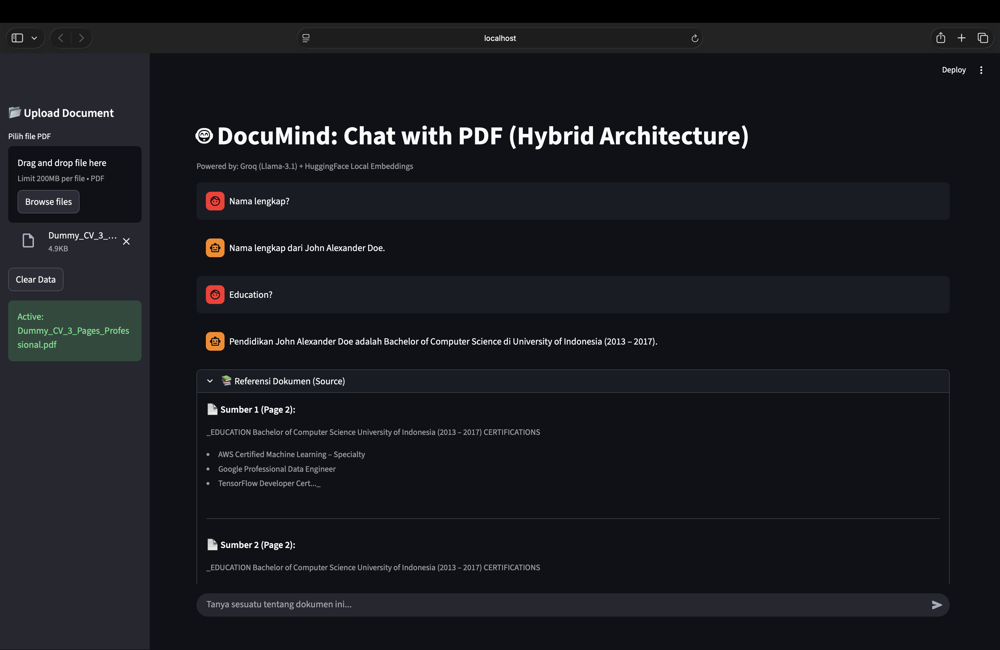
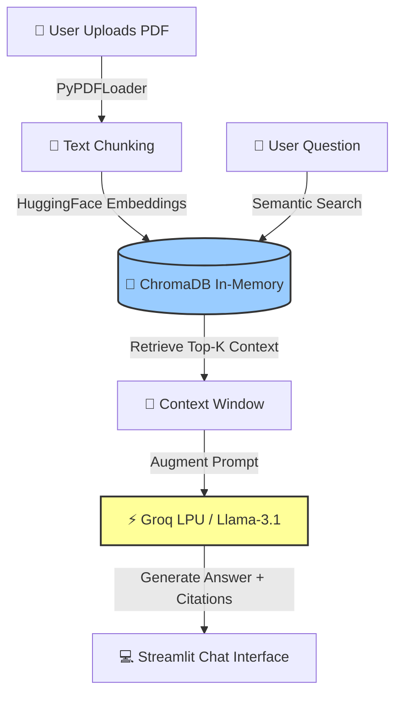

# 🤖 DocuMind: Hybrid RAG Chatbot


> **DocuMind** is a production-oriented RAG (Retrieval-Augmented Generation) application that transforms static PDF documents into interactive conversations. It features a **Hybrid AI Architecture** combining the speed of **Groq LPU** with the privacy and cost-efficiency of **Local Embeddings**.


*(Note: Upload a screenshot named `demo_app.png` to your repository root)*

## 🚀 Key Differentiators

Unlike basic RAG tutorials, this project implements **Engineering Best Practices**:

* **⚡ Hybrid Architecture:** Uses **Groq (Llama-3)** for ultra-fast reasoning while keeping vectorization local (**HuggingFace CPU**) to ensure **zero-cost embeddings**.
* **🧹 Smart State Management:** Automatically resets chat history and vector stores when switching documents to prevent "context hallucination" (zombie data from previous files).
* **🔍 Explainable AI (XAI):** Provides **Source Citations** (with page numbers) for every answer to ensure trust and verify accuracy.
* **🛡️ Secure & Clean:** Implements strict environment variable handling (`.env`) and uses a sanitized dependency list.

## 🏗️ Technical Architecture

The system follows a modular pipeline designed for Streamlit's reactive execution model:



## 🛠️ Tech Stack

*   **🤖 LLM Engine:** [Groq API](https://groq.com/) (Model: llama-3.1-8b-instant)
    
    *   _Why?_ Fastest inference speed on the market (LPU architecture), crucial for chat latency.
        
*   **🧠 Embeddings:** [HuggingFace](https://huggingface.co/) (all-MiniLM-L6-v2)
    
    *   _Why?_ Runs locally on CPU. Free, private, and eliminates external embedding API latency.
        
*   **🗄️ Vector Database:** [ChromaDB](https://www.trychroma.com/)
    
    *   _Why?_ Lightweight, runs in-memory for ephemeral sessions (no server setup required).
        
*   **🔗 Orchestration:** [LangChain](https://www.langchain.com/)
    
    *   _Why?_ Manages the Retrieval-QA chain logic and prompt engineering.
        
*   **💻 Frontend:** [Streamlit](https://streamlit.io/)
    
    *   _Why?_ Rapid prototyping with native chat UI components (st.chat\_message).
        

## ⚙️ Installation & Setup

Follow these steps to run the project locally.

**Prerequisites:**

*   Python 3.10 or higher
    
*   A [Groq API Key](https://console.groq.com/) (Free tier available)
    

**1\. Clone the Repository**

```bash
git clone [https://github.com/YOUR_USERNAME/documind-rag.git](https://github.com/YOUR_USERNAME/documind-rag.git)
cd documind-rag
```

**2\. Create Virtual Environment (Optional but Recommended)**

```bash
# Windows
python -m venv venv
venv\Scripts\activate

# Mac/Linux
python3 -m venv venv
source venv/bin/activate
```

**3\. Install Dependencies**

```bash
pip install -r requirements.txt
```

**4\. Set Up Environment Keys** 

Create a file named .env in the root directory and add your key:
```bash
GROQ_API_KEY=gsk_your_actual_api_key_here
```

**5\. Run the Application**

```bash
streamlit run app.py
```
The app will automatically open in your default browser at http://localhost:8501.


## 📂 Project Structure

```plain
documind-rag/
├── app.py                # Main application logic
├── requirements.txt      # Production dependencies
├── .env                  # API Keys (Not uploaded to GitHub)
├── .gitignore            # Security rules
└── README.md             # Documentation
```

## 🤝 Contributing

Contributions are welcome! Please feel free to submit a Pull Request.

## 📄 License

This project is open-source and available under the [MIT License](https://www.google.com/search?q=LICENSE&authuser=1).

_Created by Andri Puji Prasetiyo_